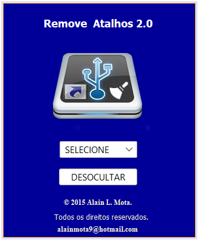

## Remove Atalhos 2.0

Este projeto foi desenvolvido com o objetivo de remover o vírus de pendrive, responsável por ocultar os arquivos e criar uma série de atalhos, além disso ele permite a restauração dos arquivos originais, bem como a eliminação de todos os atalhos.

### Tecnologia
Aqui estão as tecnologias utilizadas neste projeto.

* Java SE 8 (LTS)

### Serviços Usados
* Github
* NetBeans 8.0

### Situação do Projeto
Projeto de software descontinuado.

### Interface

### Recursos
* Remove o vírus com extensão .vbs.
* Remove os atalhos criado no pendrive.
* Desoculta os arquivos originais.

### Links
* [Repository](https://github.com/AlainMota9/Remove_Atalhos_2.0)
* [Facebook](https://www.facebook.com/alain.mota.3/)
* [Lattes](http://lattes.cnpq.br/9940114103826916)
* [linkedin](https://www.linkedin.com/in/alain-mota-a61319117/)

### Controle de versão
2.0.0.0

### Autor
Alain L. Mota: [@AlainMota](https://github.com/AlainMota9)

#### Obrigado pela Visita!

